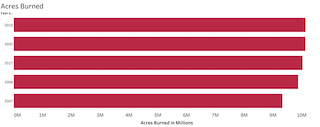

# Capstone: Image Recognition with Neural Networks

## Identifying Wildfire Smoke within an image

### Project Status: [Incomplete]

### Introduction

Over the past thirty years, the number of wildfires in the United States have decreased, yet the annual average of burned acreage has more than doubled. "Since 2000, an annual average of 70,600 wildfires has burned an annual average of 7.0 million acres. This figure is more than double the average annual acreage burned in the 1990s (3.3 million acres), although a greater number of fires occurred  annually in the 1990s (78,600 average).[[1]](#1)" 

This spike in fire intensity has caused some of the most costly and destructive fires in United States history. As it stands today, nine of the ten most costly fires (evaluated by loss in millions) in the United States have occurred since 2007.

#### Most Costly Fires in United States

| Rank | Year | Name | Dollars (in Millions) | State |
| :--- | :--- | :--- | :--- | :--- |
| 1 | 2018 | Camp Fire | \$10,750 | CA |
| 2 | 2017 | Tubbs Fire | \$9,560 | CA |
| 3 | 2018 | Woolsey Fire | \$4,520 | CA |
| 4 | 1991 | Oakland Fire | \$3,350 | CA |
| 5 | 2017 | Atlas Fire | \$3,300 | CA |
| 6 | 2020 | Glass Fire | \$3,070 | CA |
| 7 | 2020 | CZU Lightning Complex Fire | \$2,600 | CA |
| 8 | 2017 | Thomas Fire | \$2,470 | CA |
| 9 | 2020 | LNU Lightning Complex Fire | \$2,340 | CA |
| 10 | 2007 | Witch Fire | \$2,080 | CA |

In response to the spike in intensity of fires in recent years, my intent was to build a model that could assist in early wildfire detection. Leveraging an open-source camera network in California, called HPWREN, my intent is to build a deep learning model that will be able to identify wildfire smoke in a still image.

### Dataset

The images used in this project were from the [High Performance Wireless Research and Education Network (HPWREN)](https://hpwren.ucsd.edu/) which positions cameras throughout Southern California. In total, I used 3,621 annotated smoke images. The training, validation and testing dataset is divided into 3,077 images for training, 361 for validation and 183 images for testing.

### Executive Summary

In order to maximize the training data for the models I built, my initial step was to augment the existing images. Image augmentation is used to enhance the size and quality of training datasets for the purpose of creating more accurate Deep Learning models. Image augmentation algorithms vary in how the types of augmentation or transformations take place. Some of the methods that I emplored were: executing a random zoom to magnify the image, slanting an image by fixing one axis and stretching the image at a certain angle, rotating the image, and a few more.

Once my data had been transformed properly, I then built the architecture for my convulational neural network. The model incorporates three convolutional and maxpooling layers,  followed by two fully connected (dense) layers, a dropout layer (to assist with potential overfitting), and finally a non-linear layer. As convolutional networks operate linearly, this final layer introduces non-linearity to the activation map. As this model is a binary classification, in that the intent of this model is to determine whether or not smoke is present within an image, I used the sigmoid activation function which calculates the probabilities between 0 and 1.

The following image outlines the architecture of a model similar to the one I generated:

### Model Performance

The model's performance was initially evaluated using both the Accuracy metric and Loss, to determine how well the model predicted on both the Training and Validation datasets. The following table reflects the model's performance:

| Dataset | Accuracy | Loss |
| :--- | :--- | :--- |
| Training | 0.9715 | 0.0671 |
| Validation | 0.9844 | 0.0417  |

The next evaluation was to identify how well the model performed on unseen data from within the Testing set (183 images). Evaluating the result of these predictions, and focusing on those that were misclassified as False Positive were the most important for the problem statement mentioned previously. In attempting to identify wildfire smoke in an image, it was imperative to minimize the number of False Positives (where Smoke exists in the image, but is classified as No-Smoke) the model predicted.

The output of the model's predictions classified as follows:

| Classification | Count | 
| :--- | :--- |
| True Positive (TP) | 48 | 
| True Negative (TN) | 132 |
| False Positive (FP) | 0 | 
| False Negative (FN) | 3 |

### Conclusions

In conclusion, the model performed well enough on this very particular type of image in which it was trained. In this scope, I am satisfied with the outcome of this project; however, if the output images from the HPWREN camera system is altered in any way (resolution, pixels, etc.) - then I don't know how well this model would perform. I would love to gather more diverse images of wildfire smoke, different terrain, angles, and time of day to train the model on, with the hopes of it becoming more robust to differing inputs.

### Next Steps

In addition to adding more data for the model to be trained on, I would also like to alter the data in a way that would support bounding boxes to be added on the output data. A stretch goal for this project would be to tie this model to some sort of alert application that could trigger an email (or some sort of communication) when the model detects smoke 

## References
<a id="1">[1]</a> 
https://sgp.fas.org/crs/misc/IF10244.pdf

